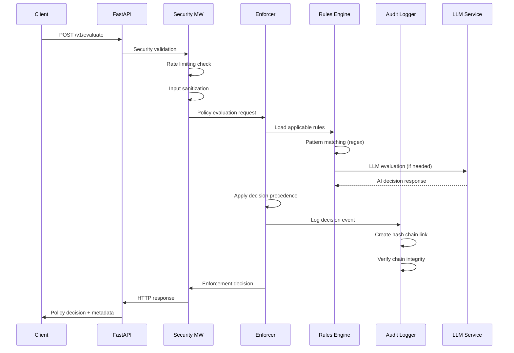
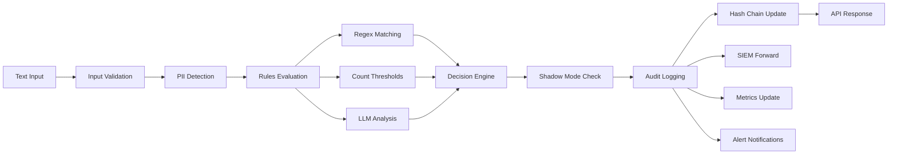
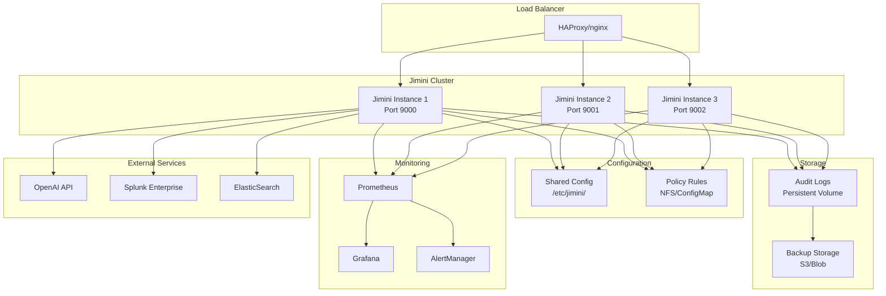
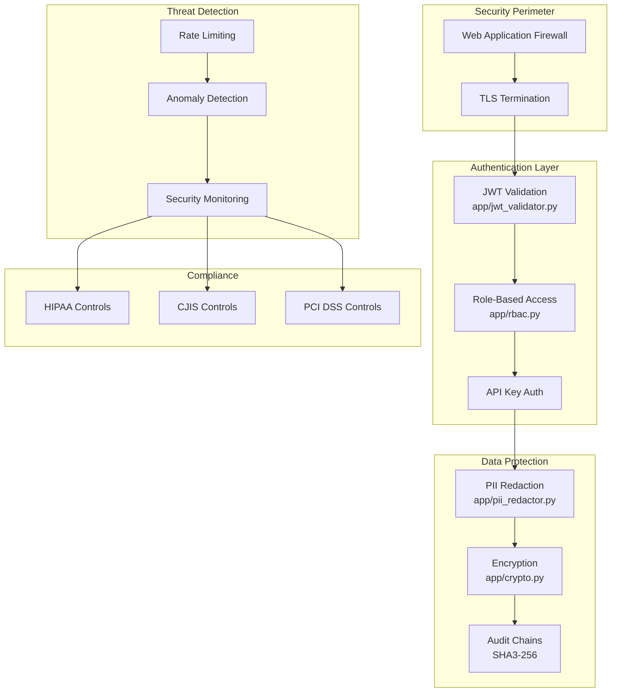

# Jimini AI Policy Gateway - Architecture Diagram

## 🏗️ **System Architecture Overview**

```mermaid
graph TB
    %% External Systems
    Client[Client Applications]
    Admin[Admin Dashboard]
    LLM[LLM Services<br/>OpenAI/Azure]
    SIEM[SIEM Systems<br/>Splunk/Elastic]
    Monitor[Monitoring<br/>Prometheus/OTEL]

    %% API Gateway Layer
    subgraph "API Gateway Layer"
        FastAPI[FastAPI Server<br/>app/main.py]
        Router[Request Router<br/>app/router.py]
        Auth[Authentication<br/>JWT/RBAC]
    end

    %% Security & Middleware
    subgraph "Security Middleware"
        SecMW[Security Headers<br/>app/security_middleware.py]
        RateLimit[Rate Limiting]
        Input[Input Validation]
    end

    %% Core Policy Engine
    subgraph "Policy Enforcement Engine"
        Enforce[Policy Enforcer<br/>app/enforcement.py]
        Rules[Rules Loader<br/>app/rules_loader.py]
        Models[Data Models<br/>app/models.py]
    end

    %% Configuration System
    subgraph "Configuration Management"
        Config[Config Loader<br/>config/loader.py]
        Secrets[Secret Management]
        Profiles[Environment Profiles<br/>dev/staging/prod]
    end

    %% Resilience & Reliability
    subgraph "Resilience Layer"
        Circuit[Circuit Breakers<br/>app/circuit_breaker.py]
        Retry[Retry Logic<br/>app/resilience.py]
        DLQ[Dead Letter Queue<br/>app/deadletter.py]
    end

    %% Security & Privacy
    subgraph "Security & Privacy"
        PII[PII Redaction<br/>app/pii_redactor.py]
        Crypto[Cryptography<br/>app/crypto.py]
        RBAC[Role-Based Access<br/>app/rbac.py]
    end

    %% Audit & Compliance
    subgraph "Audit & Compliance"
        AuditLogger[Enhanced Audit Logger<br/>app/audit_logger.py]
        AuditChain[Tamper-Evident Chains<br/>SHA3-256 Integrity]
        Compliance[Compliance Engine<br/>HIPAA/CJIS/PCI]
    end

    %% Telemetry & Observability
    subgraph "Telemetry & Observability"
        Telem[Telemetry Engine<br/>app/telemetry.py]
        OTEL[OpenTelemetry<br/>app/otel.py]
        Metrics[Metrics Collection]
    end

    %% Data Processing
    subgraph "Data Processing"
        Risk[Risk Assessment<br/>app/risk.py]
        Redact[Content Redaction<br/>app/redact.py]
        Notify[Notifications<br/>app/notifier.py]
    end

    %% CLI Management
    subgraph "CLI Management"
        CLI[Jimini CLI<br/>jimini_cli/main.py]
        Loader[Pack Loader<br/>jimini_cli/loader.py]
        Admin[Admin Tools<br/>jimini_cli/__main__.py]
    end

    %% Policy Packs
    subgraph "Policy Rule Packs"
        HIPAA[HIPAA Rules<br/>packs/hipaa/v1.yaml]
        CJIS[CJIS Rules<br/>packs/cjis/v1.yaml]
        PCI[PCI Rules<br/>packs/pci/v1.yaml]
        Secrets[Secret Detection<br/>packs/secrets/v1.yaml]
        Custom[Custom Rules<br/>policy_rules.yaml]
    end

    %% External Integrations
    subgraph "External Integrations"
        Splunk[Splunk Forwarder<br/>app/forwarders/splunk_forwarder.py]
        Elastic[Elastic Forwarder<br/>app/forwarders/elastic_forwarder.py]
        JSONL[JSONL Forwarder<br/>app/forwarders/jsonl_forwarder.py]
    end

    %% Request Flow
    Client --> FastAPI
    Admin --> FastAPI
    
    FastAPI --> Router
    Router --> SecMW
    SecMW --> Auth
    Auth --> Enforce

    %% Policy Evaluation Flow
    Enforce --> Rules
    Enforce --> Models
    Enforce --> PII
    Enforce --> Risk
    Rules --> HIPAA
    Rules --> CJIS
    Rules --> PCI
    Rules --> Secrets
    Rules --> Custom

    %% Configuration Flow
    Config --> FastAPI
    Config --> Rules
    Config --> Profiles
    Config --> Secrets

    %% Resilience Integration
    Enforce --> Circuit
    Circuit --> Retry
    Retry --> DLQ
    Circuit --> LLM

    %% Audit Trail Flow
    Enforce --> AuditLogger
    AuditLogger --> AuditChain
    AuditChain --> Compliance
    AuditLogger --> Splunk
    AuditLogger --> Elastic
    AuditLogger --> JSONL

    %% Telemetry Flow
    FastAPI --> Telem
    Enforce --> Telem
    Telem --> OTEL
    OTEL --> Monitor
    Telem --> Metrics

    %% Security Flow
    SecMW --> RateLimit
    SecMW --> Input
    PII --> Redact
    Crypto --> AuditChain
    RBAC --> Auth

    %% Notification Flow
    Enforce --> Notify
    AuditLogger --> Notify
    Circuit --> Notify

    %% SIEM Integration
    Splunk --> SIEM
    Elastic --> SIEM
    JSONL --> SIEM

    %% CLI Management
    CLI --> Config
    CLI --> Rules
    CLI --> AuditLogger
    Admin --> Loader

    %% Styling
    classDef primary fill:#e1f5fe,stroke:#01579b,stroke-width:2px
    classDef security fill:#f3e5f5,stroke:#4a148c,stroke-width:2px
    classDef audit fill:#e8f5e8,stroke:#1b5e20,stroke-width:2px
    classDef external fill:#fff3e0,stroke:#e65100,stroke-width:2px
    classDef config fill:#f1f8e9,stroke:#33691e,stroke-width:2px

    class FastAPI,Router,Enforce primary
    class SecMW,PII,Crypto,RBAC,Auth security
    class AuditLogger,AuditChain,Compliance audit
    class Client,Admin,LLM,SIEM,Monitor external
    class Config,Rules,Profiles config
```

## 🔧 **Component Interaction Matrix**

| Component | Dependencies | Interfaces | Data Flow |
|-----------|-------------|------------|-----------|
| **app/main.py** | config, router, middleware | FastAPI, HTTP | Entry point → Router → Enforcement |
| **app/enforcement.py** | rules, models, audit | Policy evaluation | Text → Rules → Decision → Audit |
| **app/audit_logger.py** | crypto, models | SHA3-256 chains | Events → Hash Chain → Integrity |
| **config/loader.py** | pydantic, yaml | Configuration | YAML → Validation → Runtime Config |
| **app/resilience.py** | circuit_breaker, deadletter | Error handling | Failures → Circuit → Recovery |
| **app/security_middleware.py** | rbac, pii_redactor | HTTP middleware | Request → Validation → Security |

## 🌊 **Request Processing Flow**

## 🔄 **Data Processing Pipeline**

## 🏛️ **Deployment Architecture**

## 📊 **Security Architecture**

---

*Architecture Version: 0.2.0 | Last Updated: October 2025 | Status: Production Ready*