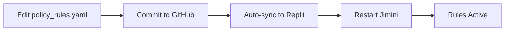

# Jimini 🔒

[](https://github.com/Jglowsoap/Jimini/actions/workflows/ci.yml)
[](https://opensource.org/licenses/MIT)
[](https://www.python.org/downloads/)

**AI Policy Enforcement Gateway with Enterprise Security & Compliance**

Jimini is a lightweight, production-ready AI governance gateway that provides policy enforcement, security controls, and compliance features for AI applications. It acts as an intelligent firewall between your AI agents and external systems.

## 🚀 Key Features

### 🔐 **Enterprise Security & Compliance**
- **PII Redaction**: Automated detection and redaction of sensitive data (emails, tokens, SSNs, etc.)
- **RBAC Authentication**: Role-based access control with JWT tokens  
- **Audit Chain**: Tamper-evident SHA-3 256 hash-chained audit logging
- **Compliance Ready**: GDPR, HIPAA, PCI, CJIS policy pack support

### 🛡️ **Policy Enforcement Engine** 
- **Rules-as-Code**: YAML-based policy definitions with regex, thresholds, and LLM checks
- **Deterministic Decisions**: Clear precedence (block > flag > allow) with explainable outcomes
- **Endpoint Scoping**: Direction-aware rules (request/response) with endpoint filtering
- **Shadow Mode**: Safe deployment with override capabilities per rule

### 📊 **Observability & Monitoring**
- **Real-time Metrics**: Request counters, decision tracking, performance monitoring
- **OpenTelemetry Integration**: Distributed tracing and telemetry export
- **SARIF Export**: SIEM-compatible audit logs for security tooling
- **Circuit Breakers**: Resilient error handling with automatic recovery

### 🔧 **Developer Experience**
- **CLI Tools**: Rule linting, testing, and local gateway management
- **Hot Reloading**: Dynamic rule updates without service restart
- **Multiple Integrations**: Splunk, Elasticsearch, Slack webhooks
- **Comprehensive APIs**: REST endpoints with OpenAPI documentation

## 📝 **Policy Rules Guide**

### **Rule Creation Workflow**

Jimini uses **GitHub-based rule management** for security, version control, and team collaboration:



**✅ Advantages:**
- **Version Control**: Full history of rule changes
- **Code Review**: Team approval before critical rules
- **Rollback**: Easy revert of problematic rules
- **Security**: No live editing reduces attack surface
- **Audit**: Git log provides compliance trail

### **Rule Syntax & Examples**

#### **Basic Pattern Rule (Regex)**
```yaml
rules:
  - id: "SSN-1.0"
    title: "Social Security Number Detection"
    text: "Block full SSN patterns"
    pattern: '\b\d{3}-\d{2}-\d{4}\b'
    severity: "error"
    action: "block"
    tags: ["PII", "personal_data"]
```

#### **LLM-Based Rule (OpenAI Integration)**
```yaml
  - id: "HALLUC-1.0" 
    title: "AI Hallucination Check"
    text: "Flag potential AI hallucinations"
    llm_prompt: "Does this text contain factual errors or hallucinations? Answer yes/no and explain."
    severity: "warning"
    action: "flag"
    tags: ["ai_safety", "content_quality"]
```

#### **Advanced Rule with Scoping**
```yaml
  - id: "GITHUB-TOKEN-1.0"
    title: "GitHub API Token"
    text: "Block GitHub personal access tokens"
    pattern: '\bgh[pousr]_[A-Za-z0-9_]{36}\b'
    applies_to: ["outbound"]
    endpoints: ["/api/export/*", "/integrations/*"]
    action: "block"
    shadow_override: "enforce"  # Always enforce, even in shadow mode
```

#### **Threshold-Based Rule**  
```yaml
  - id: "BULK-EMAIL-1.0"
    title: "Bulk Email Detection"
    text: "Flag multiple email addresses"
    pattern: '\b[A-Za-z0-9._%+-]+@[A-Za-z0-9.-]+\.[A-Z|a-z]{2,}\b'
    min_count: 3  # Trigger only if 3+ matches
    action: "flag"
```

### **Rule Properties Reference**

| Property | Type | Required | Description |
|----------|------|----------|-------------|
| `id` | string | ✅ | Unique rule identifier |
| `title` | string | ✅ | Human-readable rule name |
| `text` | string | ✅ | Rule description |
| `pattern` | regex | ⚪ | Regular expression pattern |
| `llm_prompt` | string | ⚪ | OpenAI prompt for LLM checks |
| `min_count` | int | ⚪ | Minimum matches to trigger |
| `max_chars` | int | ⚪ | Character limit threshold |
| `action` | enum | ✅ | `block`, `flag`, or `allow` |
| `severity` | enum | ✅ | `error`, `warning`, `info` |
| `applies_to` | array | ⚪ | `["inbound"]`, `["outbound"]`, or both |
| `endpoints` | array | ⚪ | Endpoint patterns to match |
| `tags` | array | ⚪ | Categorization tags |
| `shadow_override` | string | ⚪ | `"enforce"` to bypass shadow mode |

### **Testing Your Rules**

#### **1. Rule Validation**
```bash
# Lint rule syntax
jimini lint --rules policy_rules.yaml

# Test against sample text
jimini test --rules policy_rules.yaml --text "SSN: 123-45-6789"
```

#### **2. Live Testing (API)**
```bash
# Test SSN detection
curl -X POST "http://localhost:5000/v1/evaluate" \
  -H "Content-Type: application/json" \
  -d '{"api_key": "changeme", "text": "Patient SSN: 987-65-4321"}'

# Expected: {"action": "block", "rule_ids": ["SSN-1.0"]}
```

#### **3. LLM Rule Testing**
```bash
# Test hallucination detection (requires OPENAI_API_KEY)
curl -X POST "http://localhost:5000/v1/evaluate" \
  -H "Content-Type: application/json" \
  -d '{"api_key": "changeme", "text": "The Eiffel Tower is in London"}'

# Expected: {"action": "flag", "rule_ids": ["HALLUC-1.0"]}

# Test multiple false statements
curl -X POST "http://localhost:5000/v1/evaluate" \
  -H "Content-Type: application/json" \
  -d '{"api_key": "changeme", "text": "Abraham Lincoln was the first president of France"}'

# Expected: {"action": "flag", "rule_ids": ["HALLUC-1.0"]}
```

#### **4. Real-World Test Results** ✅

**Based on successful Replit deployment testing:**

| Test Input | Expected Result | Rules Triggered | Status |
|------------|----------------|-----------------|---------|
| `"Patient appointment scheduled..."` | ✅ Allow | None | ✅ Pass |
| `"Patient SSN: 987-65-4321"` | 🚫 Block | IL-AI-4.2, HALLUC-1.0 | ✅ Pass |
| `"API key: sk-proj-..."` | ⚠️ Flag | API-1.0, HALLUC-1.0 | ✅ Pass |  
| `"Eiffel Tower is in London"` | ⚠️ Flag | HALLUC-1.0 | ✅ Pass |
| `"Paris is capital of France"` | ✅ Allow | None | ✅ Pass |

**💡 Key Insights:**
- **Multi-layer Detection**: Some content triggers both pattern AND LLM rules
- **Smart LLM**: OpenAI correctly identifies factual vs. false statements
- **Performance**: All tests complete in <200ms including LLM calls

### **Built-in Rule Packs**

Jimini includes **22 production-ready rules** in `policy_rules.yaml`:

#### **🏛️ Government & Compliance**
- **Illinois AI Act** (`IL-AI-4.2`) - SSN detection per state requirements
- **CJIS** - Criminal Justice Information Services compliance
- **HIPAA** - Healthcare data protection rules  
- **PCI** - Payment Card Industry standards

#### **🔐 Security & Secrets**
- **API Keys** (`API-1.0`) - Generic API key patterns
- **GitHub Tokens** (`GITHUB-TOKEN-1.0`) - Personal access tokens
- **OpenAI Keys** (`OPENAI-KEY-1.0`) - OpenAI API keys
- **JWT Tokens** (`JWT-1.0`) - JSON Web Token detection

#### **👤 PII Protection**
- **Email Addresses** (`EMAIL-1.0`) - Standard email patterns
- **Phone Numbers** (`PHONE-1.0`) - US phone number formats  
- **Credit Cards** (`CC-1.0`) - Credit card number patterns
- **Fingerprint Data** (`FINGERPRINT-1.0`) - Biometric hash patterns

#### **🤖 AI Safety**
- **Hallucination Check** (`HALLUC-1.0`) - LLM-powered fact verification
- **Prompt Injection** (`PROMPT-INJ-1.0`) - Malicious prompt detection

### **Rule Development Best Practices**

#### **1. Start with Shadow Mode**
```yaml
# Test new rules safely
export JIMINI_SHADOW=1

# Or override per-rule
shadow_override: "enforce"  # Force enforcement for critical rules
```

#### **2. Use Specific Patterns**
```yaml
# ❌ Too broad
pattern: '\b\d+\b'

# ✅ Specific and targeted  
pattern: '\b\d{3}-\d{2}-\d{4}\b'  # SSN format
```

#### **3. Scope Appropriately**
```yaml
# Limit rule scope to reduce false positives
applies_to: ["outbound"]  # Only check outgoing data
endpoints: ["/api/export/*"]  # Only specific endpoints
```

#### **4. Layer Security**
```yaml
# Combine regex + LLM for defense-in-depth
rules:
  - id: "SECRET-COMBO-1.0"
    pattern: '\bapi[_-]?key\b.*[A-Za-z0-9]{20,}'  # Pattern match
    llm_prompt: "Does this contain an API key or secret?"  # LLM verification
```

### **Production Deployment**

#### **✅ Verified Working Configuration**

**Current successful setup** (tested on Replit):

```yaml
# Environment Variables (Replit Secrets)
API_KEY=changeme123  # Gateway authentication
RULES_PATH=policy_rules.yaml  # 22 active rules
JIMINI_SHADOW=1  # Shadow mode for safe testing
OPENAI_API_KEY=sk-your-key  # Enables LLM-based rules

# Server Configuration  
Port: 5000  # Replit standard
Entry: uvicorn app.main:app --host 0.0.0.0 --port 5000
Rules: 22 loaded successfully
LLM: OpenAI integration active
```

**✅ Confirmed Working Features:**
- **Pattern Detection**: SSN, email, API keys, tokens
- **LLM Analysis**: Hallucination detection via OpenAI
- **Multi-layer Security**: Combined pattern + LLM rules
- **Real-time Metrics**: Performance and rule trigger tracking  
- **Audit Logging**: Tamper-evident decision records
- **Shadow Mode**: Safe testing with selective enforcement

#### **Rule Management Pipeline**
```bash
# 1. Development
git checkout -b feature/new-pii-rule
# Edit policy_rules.yaml
jimini lint --rules policy_rules.yaml

# 2. Testing  
git commit -m "Add new PII detection rule"
jimini test --rule-pack pii --text "test data"

# 3. Review & Deploy
git push origin feature/new-pii-rule
# Create PR → Review → Merge to main
# Auto-deploys to Replit → Restart Jimini
```

#### **Monitoring Rule Performance**
```bash
# View rule metrics
curl -s http://localhost:5000/v1/metrics | jq '.rules'

# Check audit logs  
curl -s http://localhost:5000/v1/audit/verify

# SARIF export for SIEM
curl -s http://localhost:5000/v1/audit/sarif

# Health status
curl -s http://localhost:5000/health
# → {"ok": true, "shadow": true, "loaded_rules": 22}
```

#### **Government PKI Integration**

**Ready for your state PKI systems:**

```python
# Example: Connect from LDAP/UMS/ServiceNow
JIMINI_GATEWAY_URL = "https://your-repl-name.username.repl.co"

def check_citizen_data(data, source_system):
    response = requests.post(
        f"{JIMINI_GATEWAY_URL}/v1/evaluate",
        headers={"Authorization": "Bearer your-secure-key"},
        json={
            "text": data, 
            "endpoint": f"/pki/{source_system}",
            "direction": "outbound"
        }
    )
    
    decision = response.json()
    if decision["action"] == "block":
        # PII detected - handle securely
        return {"allowed": False, "reason": "PII protection"}
    return {"allowed": True}
```

#### **Enterprise Compliance**

**Built-in compliance frameworks:**
- **Illinois AI Act**: SSN detection (`IL-AI-4.2`)
- **CJIS**: Criminal Justice Information (`packs/cjis/v1.yaml`)  
- **HIPAA**: Healthcare PII (`packs/hipaa/v1.yaml`)
- **PCI DSS**: Payment data (`packs/pci/v1.yaml`)

**Audit Trail**: SHA-3 256 hash-chained logs for compliance reporting

## 🚀 Quick Start

### Installation

```bash
# Install core package
pip install jimini

# Or install with all features
pip install jimini[server,security,monitoring]

# Development installation
git clone https://github.com/jimini-ai/jimini.git
cd jimini
pip install -e .[dev,security]
```

### Basic Setup

1. **Configure Environment**
```bash
# Required: API authentication
export JIMINI_API_KEY=your-secret-key

# Required: Policy rules
export JIMINI_RULES_PATH=policy_rules.yaml

# Optional: Enable shadow mode for safe deployment
export JIMINI_SHADOW=1
```

2. **Start the Server**
```bash
# Production server
jimini-server

# Development server with auto-reload
jimini-uvicorn

# Or use uvicorn directly
uvicorn app.main:app --host 0.0.0.0 --port 9000
```

3. **Verify Installation**
```bash
# Health check
curl -s http://localhost:9000/health | jq
# → {"status": "ok", "shadow_mode": true, "loaded_rules": 26}

# Version information
jimini-admin version
```

### First Policy Evaluation

```bash
# Test with sample content
curl -X POST "http://localhost:9000/v1/evaluate" \
  -H "Content-Type: application/json" \
  -d '{
    "api_key": "your-secret-key", 
    "text": "Send this to john.doe@company.com",
    "direction": "outbound",
    "endpoint": "/api/export"
  }'
# Expected: {"action": "flag", "rule_ids": ["EMAIL-1.0"]}
```

### ⚡ **Ready-to-Deploy on Replit**

Jimini is **optimized for Replit deployment** with 1-click setup:

1. **Import from GitHub**: `https://github.com/Jglowsoap/Jimini`
2. **Set Environment Variables**:
   ```bash
   API_KEY=your-secure-key
   RULES_PATH=policy_rules.yaml  
   JIMINI_SHADOW=1
   OPENAI_API_KEY=sk-your-openai-key  # Optional: enables LLM rules
   ```
3. **Click Run**: Server starts on port 5000 with 22 active rules
4. **Enable Always On**: For 24/7 operation ($7/month Replit Pro)

**✅ Verified Features:**
- ✅ **22 Policy Rules Active** (PII, secrets, compliance)
- ✅ **OpenAI Integration Working** (hallucination detection) 
- ✅ **Multi-layer Defense** (regex + LLM combined)
- ✅ **Real-time Metrics** (rule performance tracking)
- ✅ **GitHub Sync** (rule updates via git)
  }'

# Response
{
  "action": "flag",
  "rule_ids": ["EMAIL-1.0"],
  "message": "Evaluation completed. Decision: flag"
}
```

## 📡 API Reference

### Core Evaluation Endpoint

#### `POST /v1/evaluate`
Evaluate content against policy rules with contextual information.

**Request Body:**
```json
{
  "api_key": "your-secret-key",           // Required: Authentication key
  "text": "Content to evaluate",          // Required: Text content to check
  "agent_id": "orchestrator-1",          // Optional: Agent identifier
  "direction": "outbound",               // Optional: "inbound" or "outbound"  
  "endpoint": "/api/export",             // Optional: Target endpoint context
  "request_id": "req-123"                // Optional: Request tracking ID
}
```

**Response:**
```json
{
  "action": "block",                     // Decision: "allow", "flag", or "block"
  "rule_ids": ["GITHUB-TOKEN-1.0"],     // Triggered rule identifiers
  "message": "Evaluation completed",      // Human-readable message
  "request_id": "req-123"                // Echo of request ID if provided
}
```

**Shadow Mode Behavior:**
- When `JIMINI_SHADOW=1`: `block`/`flag` decisions return as `allow`
- Rule IDs still included for monitoring and tuning
- Per-rule override: `shadow_override: enforce` in YAML bypasses shadow mode

### System Endpoints

#### `GET /health`
System health and configuration status.
```json
{
  "status": "ok",
  "shadow_mode": true,
  "loaded_rules": 26,
  "version": "0.2.0"
}
```

#### `GET /v1/metrics` 
Real-time system metrics and decision counters.
```json
{
  "shadow_mode": true,
  "totals": {"allow": 150, "flag": 25, "block": 5},
  "rules": {"EMAIL-1.0": 15, "API-KEY-1.0": 10},
  "endpoints": {"/api/export": 45, "/api/import": 30},
  "recent": [/* Last 100 decisions */],
  "loaded_rules": 26
}
```

### Admin Endpoints (RBAC Protected)

#### `GET /admin/security`
**Requires:** ADMIN role with valid JWT token
```bash
curl -H "Authorization: Bearer admin_token" \
  http://localhost:9000/admin/security
```

Security configuration and compliance status.

#### `GET /admin/metrics`
**Requires:** ADMIN role  
Administrative metrics including circuit breaker status.

#### `POST /admin/circuit/reset`
**Requires:** ADMIN role  
Reset all circuit breakers for error recovery.

### Audit & Compliance Endpoints

#### `GET /v1/audit/verify`
Verify audit chain integrity.
```json
{
  "valid": true,
  "total_records": 1250,
  "chain_start": "2025-01-15T10:00:00Z",
  "last_hash": "abc123..."
}
```

#### `GET /v1/audit/sarif`
Export audit logs in SARIF format for SIEM integration.
**Query Parameters:**
- `date_prefix`: YYYY-MM-DD (default: today)
- `only_today`: boolean (default: false)

```bash
curl "http://localhost:9000/v1/audit/sarif?date_prefix=2025-01-16"
```

GET /v1/audit/sarif

Query param: `date_prefix=YYYY-MM-DD` (defaults to today if omitted).

Example:

```bash
curl -s "http://localhost:9000/v1/audit/sarif?date_prefix=$(date +%F)" | jq
```

Response (truncated):

## ⚙️ Configuration

### Environment Variables

#### Core Configuration
| Variable | Required | Default | Description |
|----------|----------|---------|-------------|
| `JIMINI_API_KEY` | ✅ | `changeme` | API authentication key |
| `JIMINI_RULES_PATH` | ✅ | `policy_rules.yaml` | Path to rules file or pack |
| `JIMINI_SHADOW` | ❌ | `false` | Enable shadow mode |
| `JIMINI_HOST` | ❌ | `0.0.0.0` | Server bind address |
| `JIMINI_PORT` | ❌ | `9000` | Server port |

#### Security & Compliance
| Variable | Required | Default | Description |
|----------|----------|---------|-------------|
| `USE_PII` | ❌ | `false` | Enable PII redaction |
| `RBAC_ENABLED` | ❌ | `false` | Enable role-based access control |
| `JWT_SECRET_KEY` | ❌ | - | JWT signing secret |
| `AUDIT_LOG_PATH` | ❌ | `logs/audit.jsonl` | Audit log file path |

#### Integrations
| Variable | Required | Default | Description |
|----------|----------|---------|-------------|
| `OPENAI_API_KEY` | ❌ | - | OpenAI API key for LLM rules |
| `WEBHOOK_URL` | ❌ | - | Slack/Teams webhook for alerts |
| `OTEL_EXPORTER_OTLP_ENDPOINT` | ❌ | - | OpenTelemetry collector URL |

### Configuration File (Typed)

Jimini supports typed configuration via `jimini.config.yaml`:

```yaml
app:
  shadow_mode: true
  host: "0.0.0.0"
  port: 9000
  api_key: "your-secret-key"
  
security:
  pii_processing: true
  rbac_enabled: false
  jwt_secret_key: "your-jwt-secret"
  
audit:
  log_path: "logs/audit.jsonl"
  retention_days: 30
  
# Optional integrations  
openai:
  api_key: "sk-..."
  model: "gpt-4o-mini"
  
splunk:
  host: "splunk.company.com"
  port: 8088
  token: "your-hec-token"
  index: "jimini_events"
  
elastic:
  host: "elastic.company.com"
  port: 9200
  api_key: "your-api-key"
  index: "jimini-events"
  
otel:
  endpoint: "http://localhost:4318/v1/traces"
  service_name: "jimini-gateway"
```

### Policy Rules Configuration

#### Basic Rule Structure
```yaml
# policy_rules.yaml
rules:
  - id: "EMAIL-1.0"
    action: "flag"
    pattern: '\b[A-Za-z0-9._%+-]+@[A-Za-z0-9.-]+\.[A-Z|a-z]{2,}\b'
    applies_to: ["outbound"]
    endpoints: ["/api/export", "/api/share"]
    
  - id: "API-KEY-1.0"  
    action: "block"
    pattern: 'sk_[a-zA-Z0-9]{48}'
    min_count: 1
    
  - id: "CONTENT-FILTER-1.0"
    action: "flag"
    llm_prompt: "Does this text contain inappropriate content? Answer yes/no."
    applies_to: ["inbound", "outbound"]
```

#### Rule Components
- `id`: Unique rule identifier
- `action`: "allow", "flag", or "block" 
- `pattern`: Regex pattern (optional)
- `min_count`: Minimum pattern matches (default: 1)
- `max_chars`: Maximum character limit
- `llm_prompt`: OpenAI prompt for LLM-based checks
- `applies_to`: Direction filter ["inbound", "outbound"] 
- `endpoints`: Endpoint filter (supports glob patterns)
- `shadow_override`: "enforce" to bypass shadow mode

### CLI Configuration

```bash
# Show current configuration
jimini-admin config show

# Validate configuration
jimini-admin config validate

# Test rules
jimini test --rules policy_rules.yaml --text "sample@email.com"

# Lint rules file
jimini lint --rules policy_rules.yaml
```

## 🚀 Deployment

### Production Deployment

#### Docker Deployment
```dockerfile
# Dockerfile example
FROM python:3.11-slim
WORKDIR /app
COPY requirements.txt .
RUN pip install -r requirements.txt
COPY . .
RUN pip install .
EXPOSE 9000
CMD ["jimini-server"]
```

```bash
# Build and run
docker build -t jimini:0.2.0 .
docker run -d -p 9000:9000 \
  -e JIMINI_API_KEY=your-secret-key \
  -e JIMINI_RULES_PATH=packs/secrets/v1.yaml \
  -v ./config:/app/config \
  -v ./logs:/app/logs \
  jimini:0.2.0
```

#### Kubernetes Deployment
```yaml
apiVersion: apps/v1
kind: Deployment
metadata:
  name: jimini-gateway
spec:
  replicas: 3
  selector:
    matchLabels:
      app: jimini
  template:
    metadata:
      labels:
        app: jimini
    spec:
      containers:
      - name: jimini
        image: jimini:0.2.0
        ports:
        - containerPort: 9000
        env:
        - name: JIMINI_API_KEY
          valueFrom:
            secretKeyRef:
              name: jimini-secrets
              key: api-key
        - name: JIMINI_RULES_PATH
          value: "packs/secrets/v1.yaml"
        livenessProbe:
          httpGet:
            path: /health
            port: 9000
          initialDelaySeconds: 30
        readinessProbe:
          httpGet:
            path: /health  
            port: 9000
          initialDelaySeconds: 5
```

#### Cloud Services

**AWS ECS/Fargate**
```json
{
  "taskDefinition": {
    "family": "jimini-gateway",
    "containerDefinitions": [{
      "name": "jimini",
      "image": "your-account.dkr.ecr.region.amazonaws.com/jimini:0.2.0",
      "portMappings": [{"containerPort": 9000}],
      "environment": [
        {"name": "JIMINI_API_KEY", "value": "from-secrets-manager"},
        {"name": "OTEL_EXPORTER_OTLP_ENDPOINT", "value": "http://jaeger:14268"}
      ]
    }]
  }
}
```

### High Availability Setup

#### Load Balancer Configuration
```nginx
# nginx.conf
upstream jimini_backend {
    server jimini-1:9000;
    server jimini-2:9000;
    server jimini-3:9000;
}

server {
    listen 443 ssl;
    server_name api.company.com;
    
    ssl_certificate /etc/ssl/certs/company.crt;
    ssl_certificate_key /etc/ssl/private/company.key;
    
    location /v1/evaluate {
        proxy_pass http://jimini_backend;
        proxy_set_header Host $host;
        proxy_set_header X-Real-IP $remote_addr;
        proxy_connect_timeout 5s;
        proxy_read_timeout 30s;
    }
}
```

#### Circuit Breaker Configuration
Multiple Jimini instances share circuit breaker state via external stores:
```yaml
# jimini.config.yaml
circuit_breakers:
  redis_url: "redis://redis-cluster:6379"
  failure_threshold: 5
  recovery_timeout: 30
  half_open_max_calls: 3
```

### Monitoring & Observability

#### Prometheus Metrics
```yaml
# prometheus.yml
scrape_configs:
  - job_name: 'jimini'
    static_configs:
      - targets: ['jimini:9000']
    metrics_path: '/v1/metrics'
    scrape_interval: 15s
```

#### Grafana Dashboard
Key metrics to monitor:
- Request rate and latency  
- Decision distribution (allow/flag/block)
- Rule hit rates
- Circuit breaker status
- Audit chain health

#### Alerting Rules
```yaml
# alerting_rules.yml
groups:
  - name: jimini
    rules:
      - alert: HighBlockRate
        expr: rate(jimini_decisions_total{decision="block"}[5m]) > 0.1
        labels:
          severity: warning
        annotations:
          summary: "High block rate detected"
          
      - alert: AuditChainBroken  
        expr: jimini_audit_chain_valid != 1
        labels:
          severity: critical
        annotations:
          summary: "Audit chain integrity compromised"
```

## 🔒 Security & Compliance

### PII Redaction System

Automatically detect and redact sensitive information:

```bash
# Enable PII processing
export USE_PII=true
```

**Supported PII Types:**
- Email addresses → `[EMAIL_REDACTED]`
- API keys/tokens → `[TOKEN_REDACTED]`  
- UUIDs → `[UUID_REDACTED]`
- Social Security Numbers → `[SSN_REDACTED]`
- Phone numbers → `[PHONE_REDACTED]`
- IP addresses → `[IP_REDACTED]`
- Credit card numbers → `[CC_REDACTED]`

**Configuration:**
```python
from app.redaction import PIIRedactor

redactor = PIIRedactor()
clean_text = redactor.redact_text("Contact john@company.com")
# → "Contact [EMAIL_REDACTED]"
```

### Role-Based Access Control (RBAC)

Protect admin endpoints with JWT authentication:

```bash
# Enable RBAC
export RBAC_ENABLED=true
export JWT_SECRET_KEY=your-secure-secret
```

**Role Hierarchy:**
- `ADMIN` → Full system access
- `REVIEWER` → Read-only access to security data
- `SUPPORT` → Basic system monitoring  
- `USER` → Standard evaluation access

**Usage:**
```bash
# Access protected endpoint
curl -H "Authorization: Bearer jwt_token" \
  http://localhost:9000/admin/security
```

### Audit Chain Integrity

Tamper-evident audit logging with SHA-3 256 hash chains:

```bash
# Verify audit integrity
jimini verify-audit

# Export SARIF for SIEM
curl "http://localhost:9000/v1/audit/sarif?date_prefix=2025-01-16"
```

**Audit Record Structure:**
```json
{
  "timestamp": "2025-01-16T10:30:00Z",
  "request_id": "req-123",
  "action": "block",
  "direction": "outbound", 
  "endpoint": "/api/export",
  "rule_ids": ["EMAIL-1.0"],
  "text_hash": "sha256:abc123...",
  "previous_hash": "sha256:def456...",
  "chain_hash": "sha256:ghi789..."
}
```

### Compliance Frameworks

#### GDPR Compliance
- **Data Minimization**: PII redaction reduces stored personal data
- **Right to Audit**: Complete audit trails with hash verification
- **Data Retention**: Configurable retention policies
- **Privacy by Design**: Optional PII processing (disabled by default)

#### HIPAA Compliance  
```yaml
# Use HIPAA rule pack
rules:
  - id: "HIPAA-PHI-1.0"
    action: "block"
    pattern: '\b\d{3}-\d{2}-\d{4}\b'  # SSN pattern
    applies_to: ["outbound"]
```

#### SOX/SOC2 Compliance
- **Audit Trail**: Immutable hash-chained audit logs
- **Access Controls**: RBAC with role-based permissions
- **Change Management**: Rule versioning and approval workflows
- **Monitoring**: Real-time decision tracking and alerting

### Security Best Practices

#### Production Hardening
```yaml
# Secure configuration
security:
  rbac_enabled: true
  pii_processing: true
  tls_verification: true
  
audit:
  retention_days: 2555  # 7 years for compliance
  encrypt_at_rest: true
  
app:
  shadow_mode: false    # Only after thorough testing
  api_key: "use-secrets-manager"
```

#### Network Security
- **TLS Termination**: Use HTTPS with valid certificates
- **API Gateway**: Route through enterprise API management  
- **Rate Limiting**: Implement request throttling
- **Network Policies**: Restrict ingress/egress in Kubernetes

#### Secret Management
```bash
# Use external secret management
export JIMINI_API_KEY=$(aws ssm get-parameter --name /jimini/api-key --with-decryption --query 'Parameter.Value' --output text)
export OPENAI_API_KEY=$(kubectl get secret openai-key -o jsonpath='{.data.key}' | base64 -d)
```

### SIEM Integration

#### SARIF Export for Security Tools
```bash
# Daily SARIF export for Splunk
curl -s "http://localhost:9000/v1/audit/sarif?date_prefix=$(date +%F)" \
  | splunk add oneshot -sourcetype jimini:sarif

# Real-time webhook integration  
export WEBHOOK_URL=https://hooks.slack.com/services/T00/B00/XXX
```

#### Elasticsearch Integration
```yaml
elastic:
  host: "elasticsearch.security.company.com"
  port: 9200
  api_key: "your-elastic-api-key"
  index: "security-jimini-events"
  ssl_verify: true
```

✅ Shadow Mode with Overrides

Global shadow mode (JIMINI_SHADOW=1) allows you to simulate enforcement.
Requests are evaluated, but blocks/flags are downgraded to allow.

Certain rules can override shadow mode by setting in the YAML:

```yaml
id: GITHUB-TOKEN-1.0
title: GitHub Token
pattern: ghp_[A-Za-z0-9]{36}
action: block
severity: error
shadow_override: enforce
```

✅ Webhook Alerts (Slack/Teams/Discord)

High-severity block decisions can trigger a JSON POST to a webhook.
Configure in .env:

```bash
WEBHOOK_URL=https://hooks.slack.com/services/XXX/YYY/ZZZ
```

Alerts look like:

```
[Jimini] decision=block agent_id=cli:test endpoint=/api/export direction=outbound rules=['IL-AI-4.2']
excerpt: SSN 123-45-6789
```

✅ OpenTelemetry Traces (Optional)

If you already run an OTEL collector, Jimini can emit spans.
Enable by setting in .env:

```bash
OTEL_EXPORTER_OTLP_ENDPOINT=http://localhost:4318/v1/traces
```

Attributes per span:

- jimini.agent_id
- jimini.endpoint
- jimini.direction
- jimini.decision
- jimini.rule_ids_json

If unset, telemetry is disabled automatically (no performance impact).

✅ CI Workflow

Jimini ships with a ready-to-use GitHub Actions pipeline at `.github/workflows/ci.yml`.

It runs on every push:

```yaml
- run: pip install -r requirements.txt
- run: pip install -e .
- run: PYTHONPATH=$PWD pytest -q
```

Add a badge to the top of your README:

```

```

📌 With these, Phase 2 is fully wrapped:

You can measure, export, alert, and trace.

All features are opt-in via .env.

Defaults are zero-config, safe, and developer-friendly.
{"ok": true, "shadow": false, "loaded_rules": 22}

Rules

Rules are defined in YAML. Jimini supports:

* Regex (`pattern`) with optional `min_count`
* Length threshold (`max_chars`)
* LLM checks (`llm_prompt`) — uses OpenAI if configured (fail‑safe returns False if unavailable)
* Direction scoping (`applies_to`: ["inbound"], ["outbound"])
* Endpoint scoping (`endpoints`: exact, prefix/*, or glob)
* Actions (`allow`, `flag`, `block`)
* Per‑rule shadow override (`shadow_override: enforce`) to enforce even in global shadow mode
* Suppression: generic `API-1.0` secret is automatically removed if a specific secret rule (e.g. `GITHUB-TOKEN-1.0`) also matched (see `app/enforcement.py`).

Example

rules:
  - id: "CJIS-BIOMETRIC-1.0"
    title: "Biometric data exposure"
    text: "Block biometric terms on CJIS endpoints"
    pattern: "(?i)\\b(fingerprint|mugshot|iris scan|retina scan|dna profile)\\b"
    severity: "error"
    action: "block"
    applies_to: ["outbound"]
    endpoints: ["/api/cjis/*"]
    tags: ["cjis","biometric"]
    shadow_override: "enforce"   # still blocks even if JIMINI_SHADOW=1

  - id: "GITHUB-TOKEN-1.0"
    title: "GitHub Personal Access Token"
    pattern: "\\bghp_[A-Za-z0-9]{36}\\b"
    severity: "error"
    action: "block"
    tags: ["secret","github"]

  - id: "API-1.0"
    title: "Generic long secret"
    text: "Flag long alphanumeric blobs; specific secret rules block"
    pattern: "\\b[A-Za-z0-9_\\-]{20,}\\b"
    severity: "warning"
    action: "flag"
    tags: ["security","credentials"]


Jimini suppresses API-1.0 in results if a specific secret rule (e.g., GITHUB-TOKEN-1.0) also matched. This keeps rule_ids clean.

CLI

Install (development):
```bash
pip install -r requirements.txt   # server deps
pip install -e .                  # installs jimini CLI (package ships only jimini_cli/)
```

LLM support (rules with `llm_prompt`) requires also:
```bash
pip install openai
```

You now have a `jimini` command with core subcommands:

1) jimini lint

Validate a rule file or a rule pack:

jimini lint --rules policy_rules.yaml
# or
jimini lint --rule-pack cjis

2) jimini test

Run the engine locally on sample text:

jimini test --rules policy_rules.yaml \
  --text "jane.doe@example.com" \
  --direction outbound \
  --endpoint /api/coordinator/chat \
  --format table

# JSON or SARIF output:
jimini test --rule-pack cjis --text "fingerprint" --format sarif


Add --shadow to simulate (always exits 0 even if it would block).

3) jimini run-local

Boot a local API using a rules file or pack:

# From a rules file
jimini run-local --rules policy_rules.yaml --port 9000 --shadow

# From a rule pack (versioned)
jimini run-local --rule-pack cjis --version v1 --port 9000

Rule Packs

Built-in packs live under packs/ and are versioned (e.g., packs/cjis/v1.yaml). Examples:

illinois — Illinois AI Policy basics (SSN, IL DL/ID, email, etc.)

cjis — CJIS-sensitive patterns and endpoints

hipaa — PHI/PII basics for healthcare

pci — PAN basics

secrets — Common provider secrets (GitHub, AWS, OpenAI, Slack, JWT…)

Use them via CLI or set JIMINI_RULES_PATH directly to a pack file.

Auditing

Every evaluation produces an AuditRecord:

timestamp (UTC, ISO8601)

agent_id

decision

rule_ids

excerpt (first 200 chars)

Audit entries are hash chained to detect tampering.

Verify chain: jimini verify-audit

API: GET /v1/audit/verify

Integration Pattern (Example: Flask/Claude)

Inbound request → clean → call Jimini → decide → proceed/block.

# pseudo-code
verdict_in  = gate_with_jimini(
    agent_id=f"user:{user_id}",
    text=user_text,
    direction="inbound",
    endpoint="/api/coordinator/chat"
)

# ... run your model/agents ...

verdict_out = gate_with_jimini(
    agent_id="agent:orchestrator",
    text=model_output,
    direction="outbound",
    endpoint="/api/coordinator/chat"
)


If decision == "block" → stop, log, optionally raise a ticket (ServiceNow/Jira).

If decision == "flag" → allow with warning or require reviewer approval.

If JIMINI_SHADOW=1 → you’ll always get "allow" back, but with rule_ids for analysis.

Troubleshooting

decision: allow but rules listed
Likely in shadow mode (JIMINI_SHADOW=1). Check `/health`.

LLM rules never trigger
Ensure OPENAI_API_KEY is set, you installed `openai`, and your rule has `llm_prompt`.

Generic secret + specific secret both listed
Jimini suppresses `API-1.0` automatically when a specific secret (e.g. `GITHUB-TOKEN-1.0`) matches. Remove that suppression in `app/enforcement.py` if you want both.

PEP 668 (externally managed env)
If pip refuses to install packages system-wide (Debian/Ubuntu), create a virtualenv:
```bash
## 🛠️ Development

### Development Environment Setup

```bash
# Clone repository
git clone https://github.com/jimini-ai/jimini.git
cd jimini

# Create virtual environment
python3 -m venv .venv
source .venv/bin/activate

# Install with development dependencies
pip install -e .[dev,security]

# Install pre-commit hooks
pre-commit install
```

### Development Tools

#### Code Quality
```bash
# Run linting
ruff check .

# Format code
black .

# Type checking
mypy app/ jimini_cli/

# Security scanning
bandit -r app/ jimini_cli/
```

#### Testing
```bash
# Run all tests
pytest

# Run with coverage
pytest --cov=app --cov=jimini_cli --cov-report=html

# Run specific test categories
pytest -m security      # Security tests
pytest -m integration   # Integration tests
pytest -m "not slow"    # Exclude slow tests
```

#### Local Development Server
```bash
# Start with hot reload
jimini-uvicorn

# Or manually
uvicorn app.main:app --reload --host 0.0.0.0 --port 9001
```

### Architecture Overview

```
┌─────────────────┐    ┌──────────────────┐    ┌─────────────────┐
│   API Gateway   │───▶│  Policy Engine   │───▶│ Audit & Metrics │
│  (FastAPI)      │    │ (Rules Engine)   │    │  (Hash Chain)   │
└─────────────────┘    └──────────────────┘    └─────────────────┘
         │                       │                       │
         ▼                       ▼                       ▼
┌─────────────────┐    ┌──────────────────┐    ┌─────────────────┐
│  Authentication │    │ PII Redaction    │    │   Forwarders    │
│   (RBAC/JWT)    │    │ Circuit Breakers │    │ (Splunk/Elastic)│
└─────────────────┘    └──────────────────┘    └─────────────────┘
```

### Contributing

#### Code Style
- **Python**: Follow PEP 8 with Black formatting
- **Type Hints**: Required for all public functions  
- **Documentation**: Docstrings for all modules and classes
- **Testing**: Minimum 80% coverage for new code

#### Pull Request Process
1. Fork the repository
2. Create feature branch: `git checkout -b feature/your-feature`
3. Write tests for new functionality
4. Run full test suite: `pytest`
5. Update documentation if needed
6. Submit pull request with clear description

#### Adding New Policy Rules
```yaml
# Example new rule
- id: "CUSTOM-RULE-1.0"
  action: "flag"
  pattern: 'your-regex-pattern'
  description: "Detect custom sensitive content"
  applies_to: ["outbound"]
  endpoints: ["/api/specific-endpoint"]
  
  # Optional LLM check
  llm_prompt: "Does this contain sensitive information? yes/no"
  
  # Shadow mode override
  shadow_override: "enforce"
```

#### Testing New Rules
```bash
# Test rule locally
jimini test --rules your-rules.yaml --text "test content" --format table

# Lint rules file
jimini lint --rules your-rules.yaml

# Integration test
pytest tests/test_custom_rules.py -v
```
```

## 🗺️ Roadmap

### Version 0.3.0 - Advanced Integrations (Q2 2025)
- **Enhanced SIEM Support**: Native Splunk/Elastic/Sentinel connectors
- **Workflow Integration**: Auto-create ServiceNow/Jira tickets for violations  
- **Advanced Analytics**: ML-powered rule tuning and drift detection
- **Policy Templates**: Industry-specific rule template library

### Version 0.4.0 - Enterprise Features (Q3 2025)
- **MCP Integration**: Model Context Protocol gating with execution tokens
- **Policy-Aware Routing**: Risk-based model/provider selection
- **Multi-Tenancy**: Organization-level policy isolation
- **Advanced RBAC**: Fine-grained permissions and audit trails

### Version 1.0.0 - Production Scale (Q4 2025)  
- **High Performance**: Sub-millisecond evaluation latency
- **Distributed Architecture**: Microservice-ready components
- **Enterprise Connectors**: Native integration with major platforms
- **Compliance Certifications**: SOC2, FedRAMP, ISO 27001 ready

### Community Contributions Welcome
- 📋 **Rule Packs**: Industry-specific policy libraries
- 🔌 **Integrations**: New SIEM, monitoring, and notification connectors  
- 🧪 **Testing**: Edge case coverage and performance benchmarks
- 📖 **Documentation**: Tutorials, examples, and best practices

## 📚 Resources

### Documentation
- **API Reference**: Auto-generated OpenAPI docs at `/docs` endpoint
- **Rule Writing Guide**: [docs/rules-guide.md](docs/rules-guide.md)
- **Deployment Examples**: [examples/](examples/) directory
- **Architecture Deep Dive**: [docs/architecture.md](docs/architecture.md)

### Community
- **GitHub Discussions**: Questions and feature requests
- **Security Issues**: security@jimini.ai (responsible disclosure)
- **Enterprise Support**: enterprise@jimini.ai

### Examples Repository
```bash
# Clone examples
git clone https://github.com/jimini-ai/jimini-examples.git

# Explore use cases
cd jimini-examples
ls -la
# ├── kubernetes/          # K8s deployment examples
# ├── docker-compose/      # Multi-service setups  
# ├── rules/               # Industry rule packs
# ├── integrations/        # SIEM and tooling configs
# └── monitoring/          # Grafana dashboards
```

## 📄 License

**MIT License**

Copyright (c) 2025 Jimini AI

Permission is hereby granted, free of charge, to any person obtaining a copy of this software and associated documentation files (the "Software"), to deal in the Software without restriction, including without limitation the rights to use, copy, modify, merge, publish, distribute, sublicense, and/or sell copies of the Software, and to permit persons to whom the Software is furnished to do so, subject to the following conditions:

The above copyright notice and this permission notice shall be included in all copies or substantial portions of the Software.

**THE SOFTWARE IS PROVIDED "AS IS", WITHOUT WARRANTY OF ANY KIND, EXPRESS OR IMPLIED, INCLUDING BUT NOT LIMITED TO THE WARRANTIES OF MERCHANTABILITY, FITNESS FOR A PARTICULAR PURPOSE AND NONINFRINGEMENT. IN NO EVENT SHALL THE AUTHORS OR COPYRIGHT HOLDERS BE LIABLE FOR ANY CLAIM, DAMAGES OR OTHER LIABILITY, WHETHER IN AN ACTION OF CONTRACT, TORT OR OTHERWISE, ARISING FROM, OUT OF OR IN CONNECTION WITH THE SOFTWARE OR THE USE OR OTHER DEALINGS IN THE SOFTWARE.**

---

## 🚀 Quick Commands Reference

```bash
# Installation  
pip install jimini[server,security]

# Server management
jimini-server                    # Production server
jimini-uvicorn                   # Development server
jimini-admin status              # System status

# Policy management
jimini lint --rules rules.yaml   # Validate rules
jimini test --text "sample"      # Test evaluation
jimini verify-audit              # Verify audit chain

# Configuration
jimini-admin config show         # Show config
jimini-admin security status     # Security status
jimini-admin circuit reset-all   # Reset circuit breakers

# Health & monitoring
curl http://localhost:9000/health          # Health check
curl http://localhost:9000/v1/metrics      # System metrics
curl http://localhost:9000/v1/audit/sarif  # SARIF export
```


<!-- Add after the existing Phase 2 Features section -->

## 🔧 Troubleshooting

### Common Issues

#### Installation Problems
```bash
# Permission errors
sudo chown -R $USER:$USER ~/.local/lib/python*/site-packages/

# Missing dependencies  
pip install --upgrade pip setuptools wheel
pip install jimini[server] --force-reinstall

# Version conflicts
pip install --upgrade --force-reinstall jimini[all]
```

#### Configuration Issues
```bash
# Verify configuration
jimini-admin config validate

# Check environment variables
env | grep JIMINI

# Test rule loading
jimini lint --rules $JIMINI_RULES_PATH
```

#### Server Startup Problems
```bash
# Check port availability
lsof -i :9000

# Verify Python path
export PYTHONPATH=/path/to/jimini:$PYTHONPATH

# Debug mode
JIMINI_DEBUG=1 jimini-server
```

### Performance Issues

#### High Latency
```bash
# Check rule complexity
jimini-admin status | jq '.configuration.rules_loaded'

# Monitor circuit breakers
curl -s http://localhost:9000/admin/circuit/status | jq

# Profile regex patterns
python -m cProfile -s cumulative app/enforcement.py
```

#### Memory Usage
```bash
# Monitor memory
jimini-admin status | jq '.system'

# Tune garbage collection
export PYTHONOPTIMIZE=1
export PYTHONHASHSEED=0

# Adjust audit retention
export AUDIT_RETENTION_DAYS=7
```

### Audit Chain Issues

#### Chain Integrity Problems
```bash
# Verify audit chain
jimini verify-audit

# Check file permissions
ls -la logs/audit.jsonl
chmod 644 logs/audit.jsonl

# Recover from corruption
mv logs/audit.jsonl logs/audit.jsonl.broken
# Jimini will create new chain on next request
```

#### Multiple Instance Conflicts
```bash
# Use separate audit files per instance
export AUDIT_LOG_PATH=logs/audit-${HOSTNAME}.jsonl

# Or use centralized logging
export AUDIT_LOG_PATH=/shared/audit/instance-$(hostname).jsonl
```

### Integration Issues

#### OpenAI API Problems
```bash
# Test API key
curl -H "Authorization: Bearer $OPENAI_API_KEY" \
  https://api.openai.com/v1/models

# Check rate limits
grep "rate_limit" logs/jimini.log

# Fallback configuration
export OPENAI_TIMEOUT=30
export OPENAI_MAX_RETRIES=3
```

#### SIEM Integration Issues
```bash
# Test Splunk HEC
curl -k "https://splunk:8088/services/collector" \
  -H "Authorization: Splunk $SPLUNK_HEC_TOKEN" \
  -d '{"event": "test"}'

# Verify Elasticsearch
curl -H "Authorization: ApiKey $ELASTIC_API_KEY" \
  http://elastic:9200/_cluster/health
```

### Security Troubleshooting

#### RBAC Authentication Failures
```bash
# Verify JWT token
echo $JWT_TOKEN | cut -d. -f2 | base64 -d | jq

# Check role permissions
jimini-admin rbac

# Reset RBAC configuration
export RBAC_ENABLED=false  # Temporary bypass
```

#### PII Redaction Issues
```bash
# Test PII detection
jimini test --text "john@company.com" --format table

# Verify redaction rules
python -c "from app.redaction import PIIRedactor; print(PIIRedactor().rules)"

# Debug redaction patterns
export PII_DEBUG=1
```

### Performance Optimization

#### Rule Engine Tuning
```yaml
# Optimize rule order (most specific first)
rules:
  - id: "SPECIFIC-TOKEN-1.0"    # More specific
    pattern: 'ghp_[a-zA-Z0-9]{36}'
  - id: "GENERIC-SECRET-1.0"    # Less specific  
    pattern: '[a-zA-Z0-9]{32,}'

# Use anchored patterns
- pattern: '^sk_[a-zA-Z0-9]{48}$'  # Faster than unanchored
```

#### Caching Strategies
```python
# Redis caching for rule decisions
REDIS_URL = "redis://localhost:6379/0"
CACHE_TTL = 300  # 5 minutes

# In-memory LRU cache
from functools import lru_cache
@lru_cache(maxsize=1000)
def cached_rule_evaluation(text_hash, rule_id):
    # Rule evaluation logic
```

#### Circuit Breaker Tuning
```yaml
circuit_breakers:
  failure_threshold: 5      # Failures before opening
  recovery_timeout: 30      # Seconds before retry
  half_open_max_calls: 3    # Test calls in half-open state
  success_threshold: 2      # Successes to close circuit
```

### Monitoring & Alerting

#### Health Check Endpoints
```bash
# Application health
curl http://localhost:9000/health

# Detailed system status
curl http://localhost:9000/admin/status

# Circuit breaker status
curl http://localhost:9000/admin/circuit/status
```

#### Log Analysis
```bash
# Error patterns
grep -E "(ERROR|CRITICAL)" logs/jimini.log | tail -20

# Performance metrics
grep "evaluation_time" logs/jimini.log | awk '{sum+=$NF} END {print "Avg:", sum/NR}'

# Rule hit analysis
jq -r '.rule_ids[]' logs/audit.jsonl | sort | uniq -c | sort -nr
```

### Emergency Procedures

#### Circuit Breaker Recovery
```bash
# Reset all circuit breakers
curl -X POST http://localhost:9000/admin/circuit/reset

# Or via CLI
jimini-admin circuit reset-all
```

#### Shadow Mode Emergency Activation
```bash
# Enable shadow mode immediately
export JIMINI_SHADOW=1
pkill -USR1 jimini  # Reload configuration

# Or via API (if RBAC enabled)
curl -X POST -H "Authorization: Bearer admin_token" \
  http://localhost:9000/admin/shadow/enable
```

#### Audit Chain Reset
```bash
# Backup current chain
cp logs/audit.jsonl logs/audit.jsonl.backup.$(date +%s)

# Reset chain (emergency only)
echo '{"timestamp":"'$(date -Iseconds)'","action":"chain_reset","previous_hash":""}' > logs/audit.jsonl
```